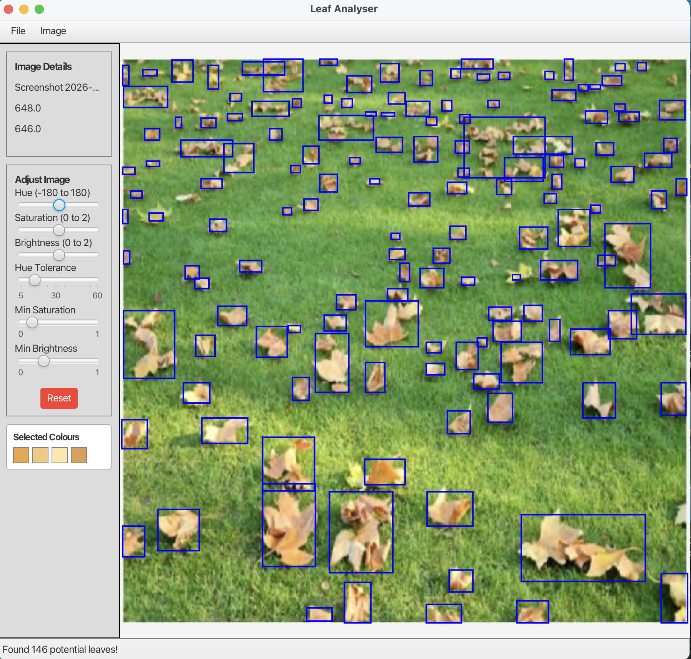
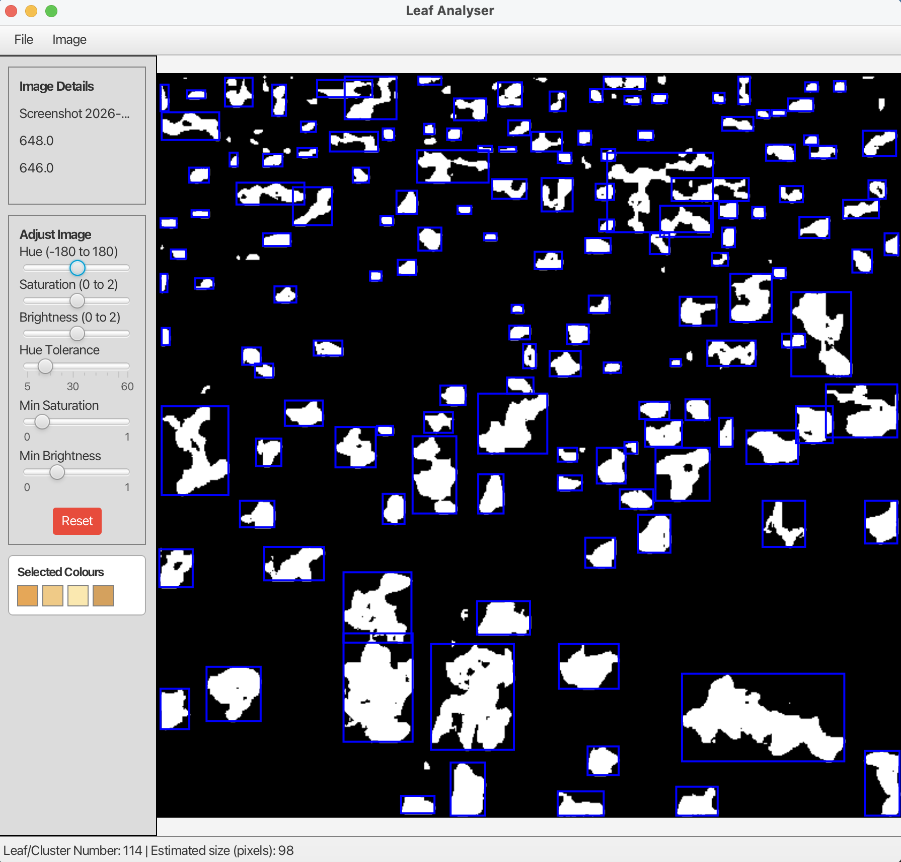
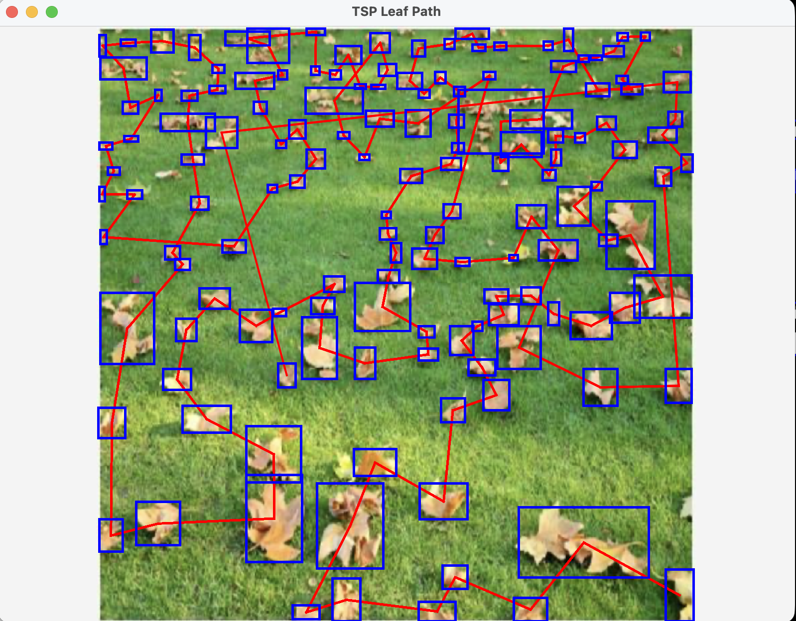

# Autumn Leaves Detection System

## Overview
A JavaFX application that detects and counts leaf clusters in images using image processing and Union-Find.

## Features
- Converts image to black and white using colour thresholds
- Detects clusters using Union-Find (disjoint set)
- Filters noise using size thresholds
- Displays clusters with bounding boxes
- Implements a simple TSP (nearest neighbour) to connect clusters
- Benchmarked key operations using JMH

## Technologies
- Java
- JavaFX
- JUnit
- JMH

## Algorithms
- Union-Find (Disjoint Set)
- Graph traversal
- Nearest Neighbour (TSP)

  ## Example Output

### Leaf Detection (Final Output)
The system detects and outlines leaf clusters using bounding boxes.

### Black & White Conversion
Image is converted using colour thresholding to isolate leaf regions.

### Path Optimisation (TSP)
A nearest neighbour approach is used to compute a path connecting all clusters.

## Notes
This project was developed as part of a Data Structures & Algorithms module and achieved 100%.
